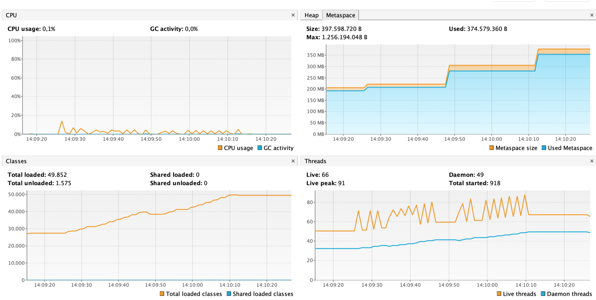
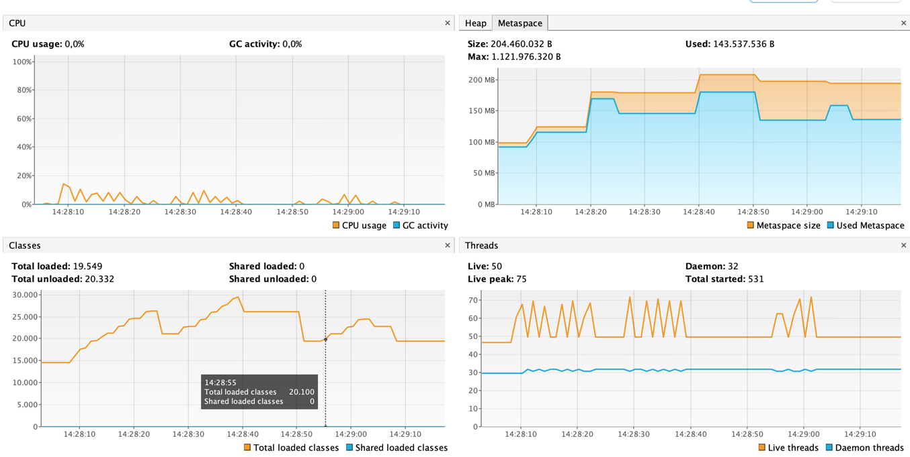

# scalatestleak
https://github.com/scalatest/scalatest/issues/1960

Use visualvm and monitor loaded classes / metaspace / threads, try to force gc using the button between `test` runs

You should see something like this:

This is with the akka based eventually (no leak):
